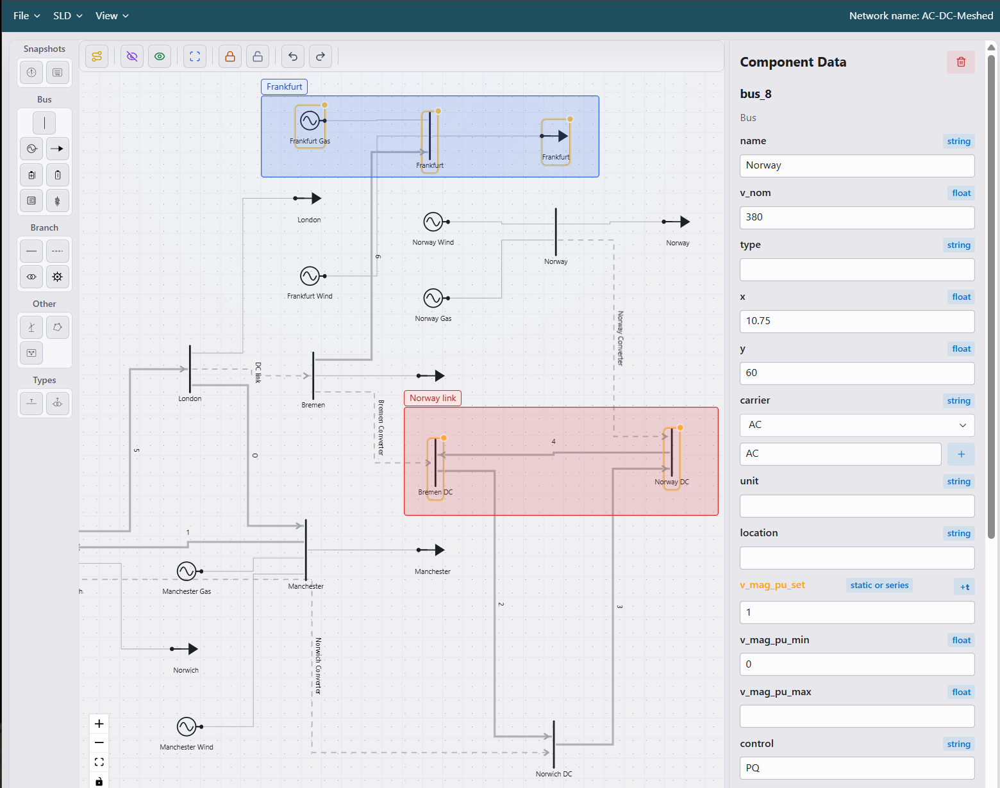

# PyPSA Network Builder




## Features
* Import and export networks in Pypsa Formats
* Drag and drop nework builder
* Auto routing network
* Region marker
* Hide components
* Lock components and areas in place
* Run network in Jupyer
* Extensive PyPSA website examples
* Data view and editor
* All component paramaters exposed
* Time series params exposed (needs attention)


## Setup
```bash
uv sync
uv run reflex run
```

## Windows desktop installer
```powershell
.\scripts\build-desktop.ps1
```
