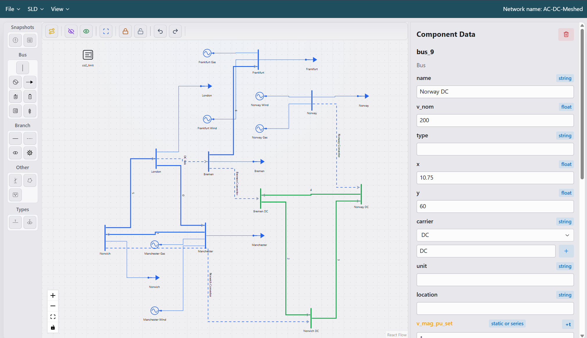
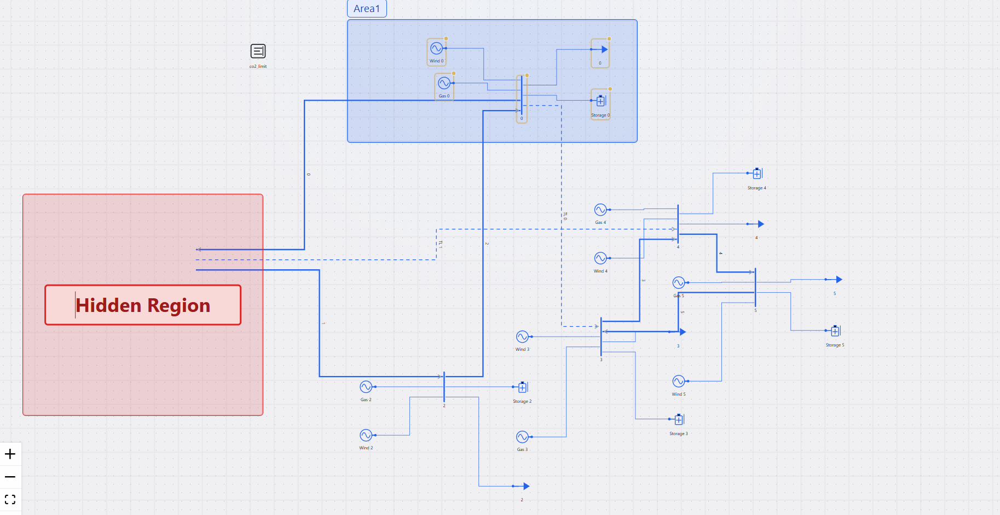
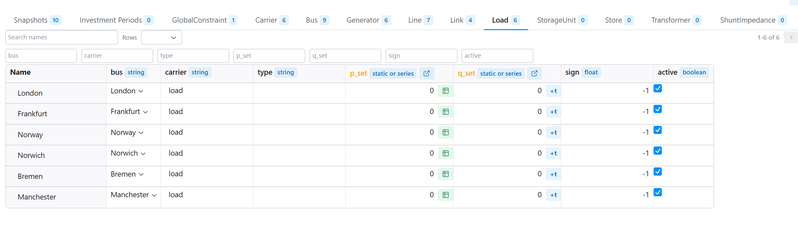
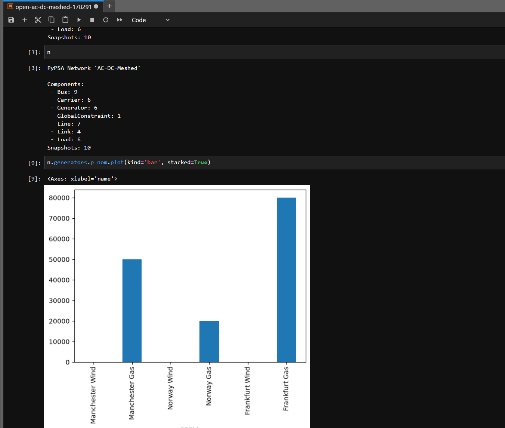

#  Demonstration

<video width="640" height="360" autoplay muted playsinline controls>
  <source src="imgs/builder.mp4" type="video/mp4">
  Your browser does not support the video tag.
</video>


# Features

* PyPSA graphical user interface (GUI)
* Drag and drop PyPSA network builder
* Import and export Pypsa networks
* Set up snapshots and multi-investment periods (needs attention)
* Auto routing and layout of network single line diagram
* Single line diagram region marker
* Zoom to a marked region in single line diagram
* Hide PyPSA network components in single line diagram
* Lock components and areas in place
* Open and run the current network in Jupyer Notebook
* Extensive PyPSA website examples included for loading
* Network data view and editor
* All component parameters exposed
* Time series parameters exposed and editable (needs attention)
* Re-route individual network branches on singel line diagram


# Why PyPSA-Studio

Currently there are no end to end [PyPSA gui](https://docs.pypsa.org/v1.0.5/user-guide/faq/#does-pypsa-have-a-gui).
The learning curve in especialy creating new networks in PyPSA can be difficult. 

This project aims to get new users up and running quickly to create a new network and start using it in Jupyer notebook 
if they want to, or export it for further use elsewhere. 


# Alternatives

I found this alternatives, attempts or discussions for review:
- [PyPSA App](https://github.com/PyPSA/pypsa-app)
- [PyPSA drawer](https://nimabahrami.github.io/pypsa-drawer/?trk=public_post_comment-text)
- [PyPSA network explorer](https://pypsa-explorer.streamlit.app/)
- [Mailing list - Gui discussion](https://groups.google.com/g/pypsa/c/F9ip0viE0dA/m/w75-CdwPAAAJ)
- [Mailing list – Steep curve](https://groups.google.com/g/pypsa/c/HB-J3aDvr8w/m/DyylBsSkAgAJ)

# Active development

This package is under active development.


# Platforms

The application has been tested on:
- Windows - Working
- Mac – Working
- Linux – to be tested


# Quick start

```terminal
git clone https://github.com/Tooblippe/pypsa-studio.git
cd pypsa-studio
uv sync
uv run reflex run
```

# Installation

## Install uv

Install the uv package manager if you do not have it unstalled already.
[Instructions here](https://docs.astral.sh/uv/getting-started/installation/)

## Clone repo

```terminal
git clone https://github.com/Tooblippe/pypsa-studio.git
cd pypsa-studio
```
## Run application

```terminal
uv sync
uv run reflex run
```

# Application Navigation



- Components pallet
  - Snapshots
  - Bus
  - Branch
  - Other
  - Types
- Controls
  - Auto route
  - Hide all
  - Show all
  - Mark region
  - Lock
  - Unlock
  - Undo 
  - Redo
- Canvas
- Components data
  - Component attributes

# Solving or interacting with network in Python

- Currently it will be best to run the network in [Jupyter](https://docs.jupyter.org/en/latest/)
- Create or load an `Examples` network 
- To run in `Jupyter` -  click `File` -> `Open in Jupyter`
- This will save your current network, open the Network in `Jupyer`, and run the first cell
- The network will be exposed as variable `n`
- Changes made to the network will not persist back to the original loaded network exept if you export the network and open it again in PyPSA-Studio (will improve on this!)
- If you do not want to use `Jupyter` just export the network and import it into an environment of your choice


# Screenshots
## Mark and Hide Regions


## Data editor


## Open in Jupyter



# Sponsor 

|                   |                                                                                                                                                                                                                                                                                                                                                                                                                                                                                                                                                                        |
|-------------------|------------------------------------------------------------------------------------------------------------------------------------------------------------------------------------------------------------------------------------------------------------------------------------------------------------------------------------------------------------------------------------------------------------------------------------------------------------------------------------------------------------------------------------------------------------------------|
|  | Africa Power Ventures (APV) builds, bespoke PyPSA simulation models that co-optimise generation and transmission investment across complex power systems — including hydro cascades, BESS deployment, reserve requirements, and price projections. APV also simulates dynamic electricity markets that support wheeling, imports, exports, and cross-border trading. <br/>[About](https://afripow.com/services/) <br/>[Services](https://afripow.com/about-us/)<br/> [Twitter](https://x.com/Afripow/)<br/> [Linkedin](https://www.linkedin.com/company/africa-power-ventures/) |

# Source Code
Find the code on [Github](https://github.com/Tooblippe/pypsa-studio)